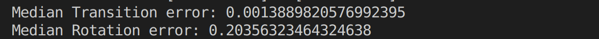
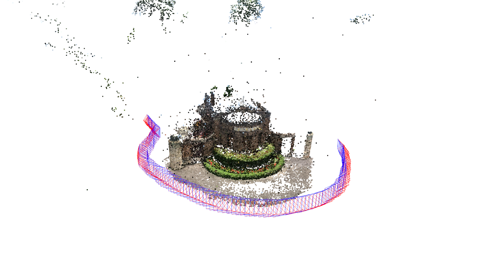
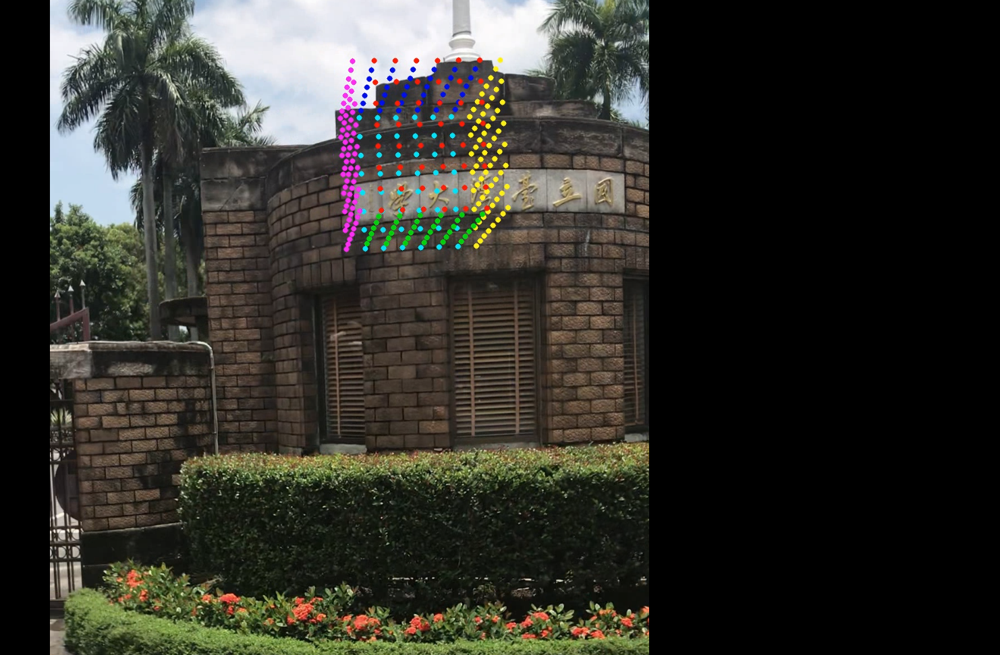

# Homework2

Dataset: [Download](https://drive.google.com/u/0/uc?export=download&confirm=qrVw&id=1GrCpYJFc8IZM_Uiisq6e8UxwVMFvr4AJ)


# 3DCV_HW2_Report

## MINHSUNA CHENG (P10942A05)

Easy Run on linux cmd

```sh
git clone git@github.com:NTU-CSIE-3dcv-TA/homework-2--updated-min86615.git
cd homework-2--updated-min86615
# on python 3.8.13
# please download Dataset and extract to homework-2--updated-min86615 directory
pip install numpy opencv-python scipy open3d pandas 
# for problem 1-1 1-2
# P3P and RANSAC Evaluation median pose error
# get list_rot.npy and list_trans.npy
python 2d3dmathcing.py
# for problem 1-3
# Camera pose projection on open3d
python plot_camera_pose.py
# for problem 2
# Video like AR -> get result.mp4
python write_videos.py
```

### Problem 1: Camera pose estimation

- **Problem 1-1**
  P3P RANSAC Pipeline explaintion
  - Load corresponding image kp and desc from pkl file
  - Estimate maximum iteration and undistort points2D points
  - Random select 6 points 3 for P3P and 3 for validation points to select correct matrix
  - Solve P3P Process
    - Use select legth to get 3 point distance a, b, c
    - Use 3 3D points and a, b, c solve trilaterate (reference https://github.com/akshayb6/trilateration-in-3d/blob/master/trilateration.py) and get 2 answer of translation
    - get lambda and calculate rotation matrix r
    - Use valid points select minimum loss as best rotation and translation matrix (return value)
  - Select max inlier points rotation and translation matrix 
  - Get Result!

- **Problem 1-2:**
  We use 1-1 rotation and translation result (list_rot.npy and list_trans.npy) calculate the error use L2 norm in translation and calculate median of relative rotation with ground truth value.
  - The detail error show in below picture
    - Translation error: 0.001388998 ...
    - Rotation error: 0.20356323 ...
  

- **Problem 1-3:**
    We use 1-1 rotation and translation result (list_rot.npy and list_trans.npy) and use open3d api to plot image corresponding camera pose.
  - Camera pose result
  

- **Conclusion Above Result**
  - **Process some boundary case**
  In solve P3P length process we will encounter some boundary case cause some runtime error we can handle it to prevent divide by zero.
  - **Re-RANSAC use inlier points**
  To enhence our accuracy we can RANSAC again when we selected best rotation matrix.

### Problem 2: AR application

- **The one frame of result video**
  
- **Pipeline explaintion**
  - First we assign our cube vertices and load it
  -  Assign surface color / surface vertices index / cameraMatrix information
  - select valid image and serialized load image and ground truth image camera pose
  - get Camera Matrix dot RT matrix for reproject cube vertices
  - transform vertice use surface 2 points vector to get nxn surface points set
  - use cv2 circle to plot cube on per frame
  - Write video!  
- **Conclusion Above Result**
  - **Use paiter algorithm to get better 3d result**
  Use painter algorithm to remove some shaded points.