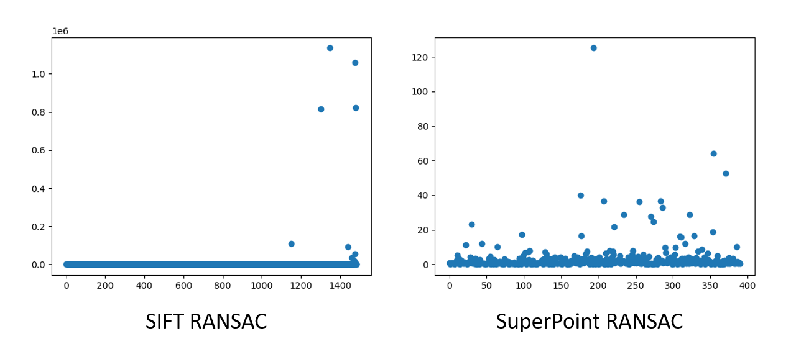
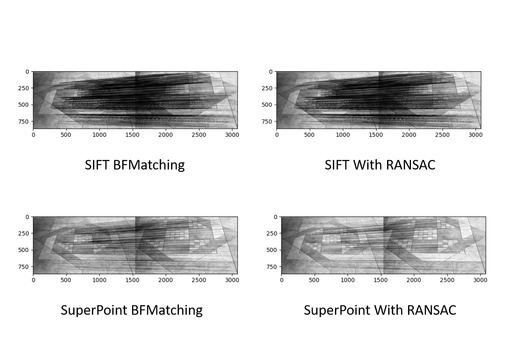
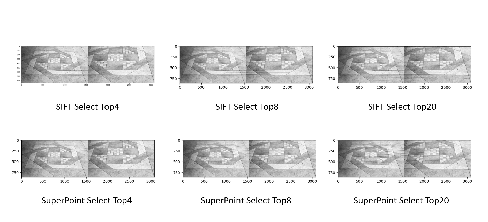
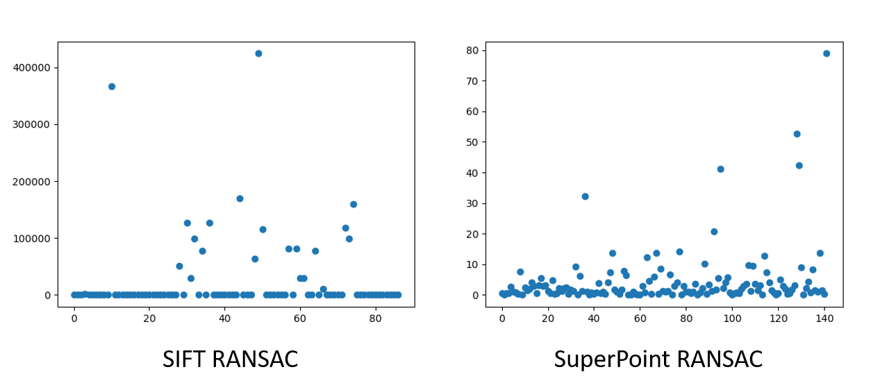
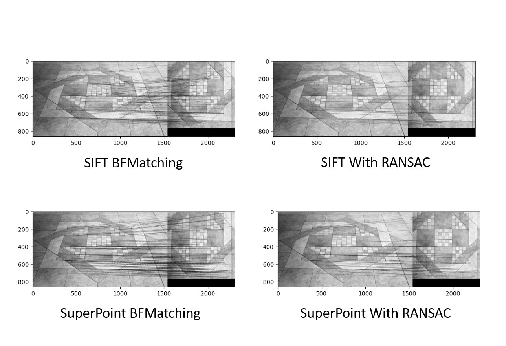
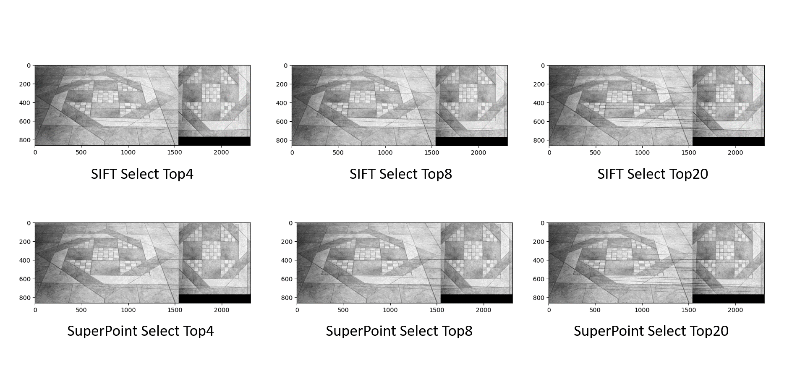
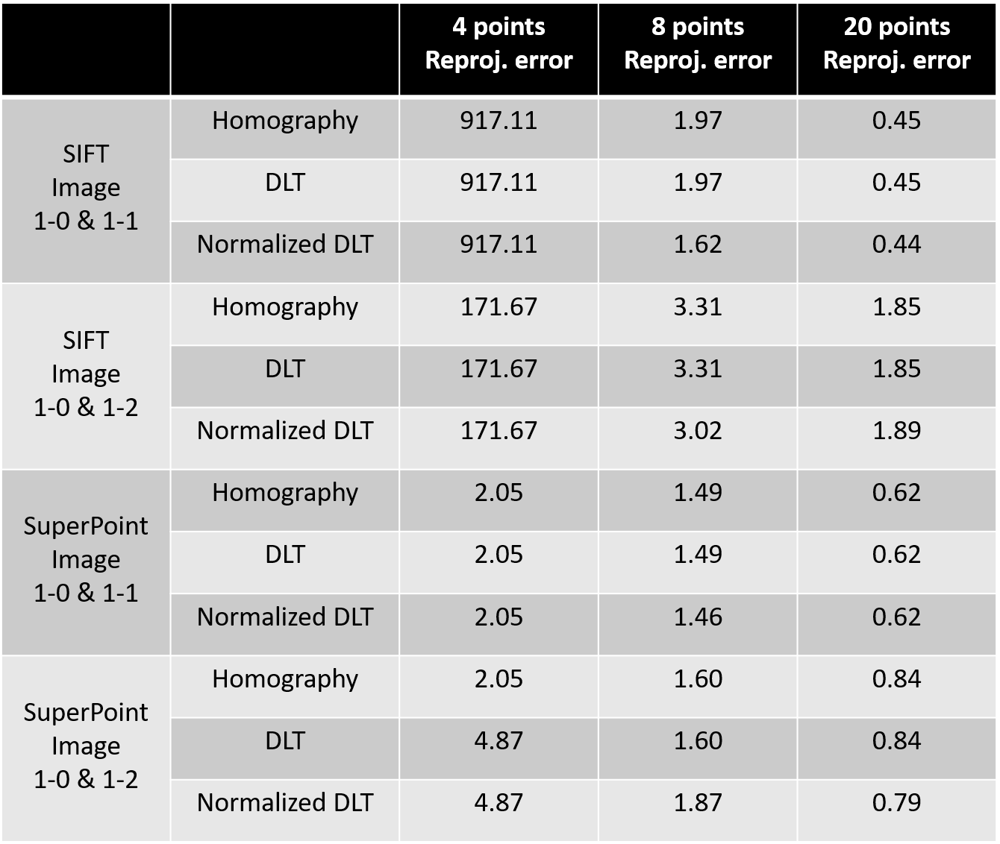
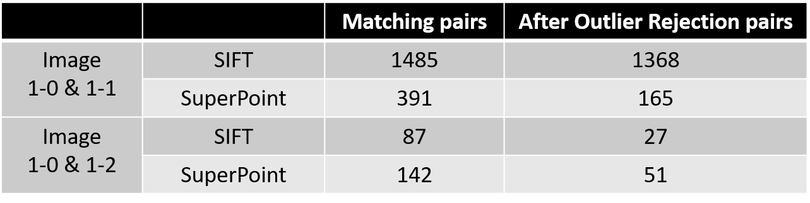
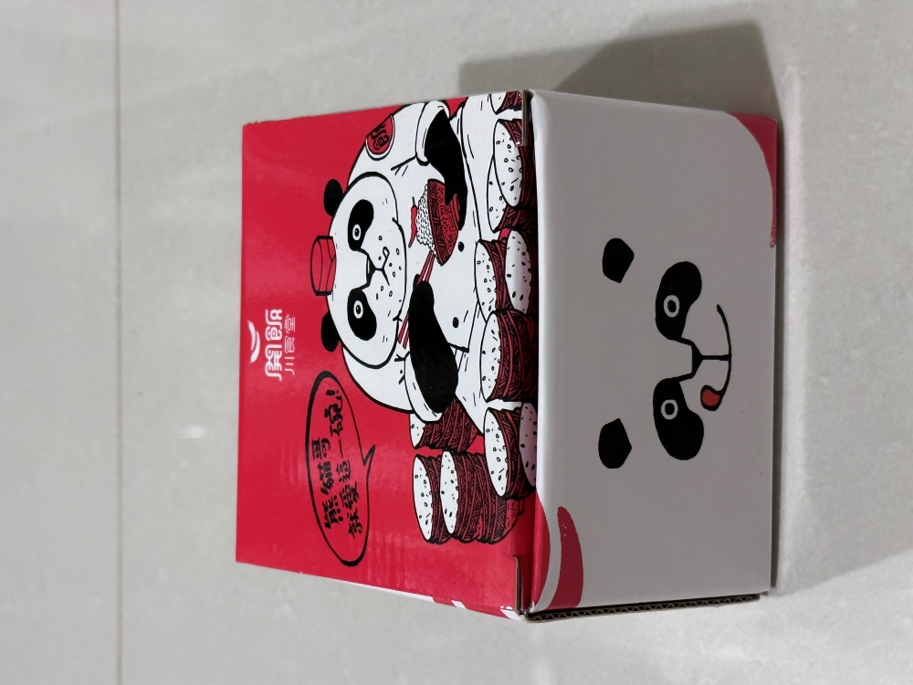
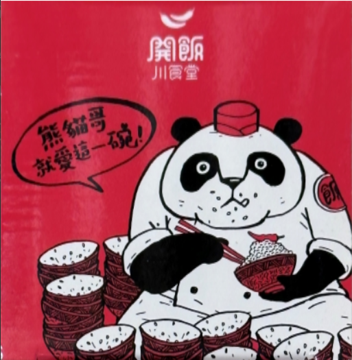

# 3DCV_HW1_Report

## MINHSUNA CHENG (P10942A05)

Easy Run on windows cmd

```sh
git clone https://github.com/NTU-CSIE-3dcv-TA/ntu-csie-3dcv-homework1-min86615.git
cd ntu-csie-3dcv-homework1-min86615
# Notice our result running on gpu, cpu result will get a little bit different.
pip install numpy opencv-python torch matplotlib
# for problem 1
# SIFT
python 1.py [img1_path]  [img2_path] [ground_truth_path]
python 1.py images\1-0.png  images\1-1.png  groundtruth_correspondences\correspondence_01.npy
# SuperPoint (Code from Magic Leap)
python superpoint_detection.py images\1-0.png  images\1-1.png  groundtruth_correspondences\correspondence_01.npy
# for problem 2
python 2.py
```

### Problem 1: Homography Estimation

- **Image 1-0 / 1-1 pairs**
  BFMatching Result and Automatically outlier rejection use RANSAC
  - The outlier rejection process plot SIFT / SuperPoint
  
  - Matching Result
  
  - Select K point 4/8/20
  

- **Image 1-0 / 1-2 pairs**
  BFMatching Result and Automatically outlier rejection use RANSAC
  - The outlier rejection process plot SIFT / SuperPoint
  
  - Matching Result
  
  - Select K point 4/8/20
  

- **The Overall comparison**
  - The outlier rejection process plot
  
  - Matching Result
  

- **Conclusion Above Result**
  - **Different K points**
  In four points result, we can observe 1-0 and 1-1 image pairs get large error. To explain it we show select Top K result point pairs in **Select K point 4/8/20** section. We thought this condition will occur in four point almost in one line (collinearity).
  In 8 or even 20 points the result more stable and error decrease dramatically. Because we select more points in different locations, it will more robust for our estimated result.
  - **DLT / Normalized DLT**
  Compare DLT and Normalized DLT we can observe the Normalized DLT approach get lower reprojection error in high sampling points case. Same as Machine Learning application the normalized operation can reduce the differeces in sampling points location.
  - **SIFT / SuperPoint**
  First SIFT have better performance in fewer viewpoint change case include the number of keypoints detection and the reprojection error. In recent survey, SIFT have more high accuracy in localization / 3D Reconstruction case. (Paper from [Image Matching across Wide Baselines: From Paper to Practice](https://arxiv.org/abs/2003.01587))
  SuperPoint have more strong detection capability in viewpoint change case. The 1-0 and 1-2 pairs Superpoint get 142 points but SIFT only get 87 points.

### Problem 2: Document Rectification

- **Captured image**
  
- **Rectification Result Images**
  
- **Pipeline explaintion**
  - First we modified mouse_click_example.py to click corner and get correspondence points
  - Next we use acquired points and assigned our expected image size. Use homography estimation to get homography matrix.
  - Notice, we have to inverse our homography matrix and dot output image per pixels location. This step we will get the pixel location in our input image (float, float).
  - Last step we have to solve float coordination problem. Bilinear interpolation is common approch to solve this problem.
  - Get Result!

```sh
Reference from Magic Leap SuperGlue / SuperPoint
@inproceedings{sarlin20superglue,
  author    = {Paul-Edouard Sarlin and
               Daniel DeTone and
               Tomasz Malisiewicz and
               Andrew Rabinovich},
  title     = {{SuperGlue}: Learning Feature Matching with Graph Neural Networks},
  booktitle = {CVPR},
  year      = {2020},
  url       = {https://arxiv.org/abs/1911.11763}
}
```
